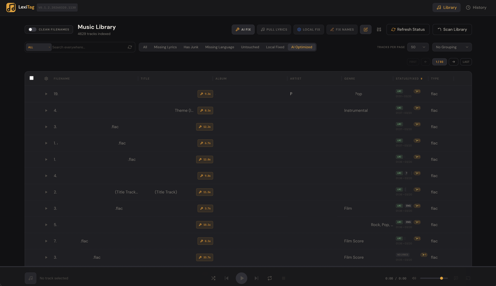

# LexiTag — Intelligent Music Metadata Manager



LexiTag is a state-of-the-art music library manager designed to clean, organize, and discover junk in your track metadata using advanced pattern matching and AI.

## Key Features (v0.1.3)

- **Intelligent Metadata Discovery**: Automatically identifies site-specific junk signatures (TamilVaathi, Isaimini, etc.) during library scans.
- **Review Dashboard**: Interactive interface in **Settings → Cleanup Rules** to Approve/Dismiss discovered junk candidates.
- **Asynchronous Database**: High-speed track analysis powered by an async SQLite engine.
- **Log Silence Filter**: Clean production output by suppressing high-frequency background polling noise.
- **Dynamic Library Management**: Easily add and manage multiple library sources directly through the UI.

## 🛠️ Deployment via Docker

Deploying LexiTag is simple. Ensure you have Docker and Docker Compose installed.

**Official Image**: [lokeshsg/lexitag (Docker Hub)](https://hub.docker.com/r/lokeshsg/lexitag)

### 1. Configuration
Download the source files and prepare your environment:

1. Copy the template file: `cp .env.example .env`
2. Open `.env` and configure your settings:

```env
# ── Security ──
# Required for dashboard access
LEXITAG_AUTH_TOKEN=your_secure_token_here

# Required for dashboard access
LEXITAG_AUTH_TOKEN=your_secure_token_here

# A strong secret string of your chioce to encrypt your AI keys in the database
LEXITAG_MASTER_KEY=your_secret_password_here

# ── Environment ──
ENV=production

# ── Search (Optional) ──
# Get free keys at: https://programmablesearchengine.google.com
GOOGLE_CSE_KEY=your_google_api_key
GOOGLE_CSE_CX=your_search_engine_id
```

### 2. Launching the Container
Run the following command in the application directory:

```bash
docker compose up -d --build
```

### 3. Volume Mapping
Link your data and music library folders in `docker-compose.yml`:
```yaml
    volumes:
      - ./data:/app/data
      - /path/to/your/music:/app/music # Mount your music library (Read/Write access required)
```

### 4. AI Provider Setup
Once logged in, navigate to **Settings → AI Providers** to add your OpenAI, Gemini, or local LLM keys directly through the interface.

---

## Development Note
This production codebase is a clean-slate, optimized version of the development environment. It contains no confidential data, local databases, or personal API keys. 

*Release Version: 0.1.3*
