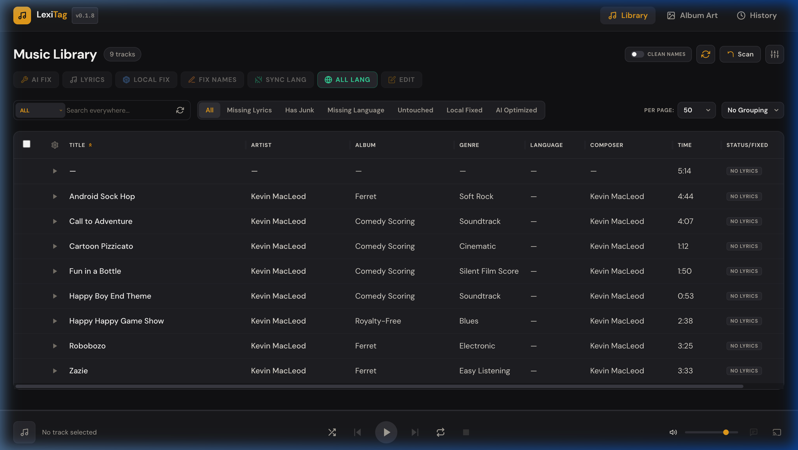
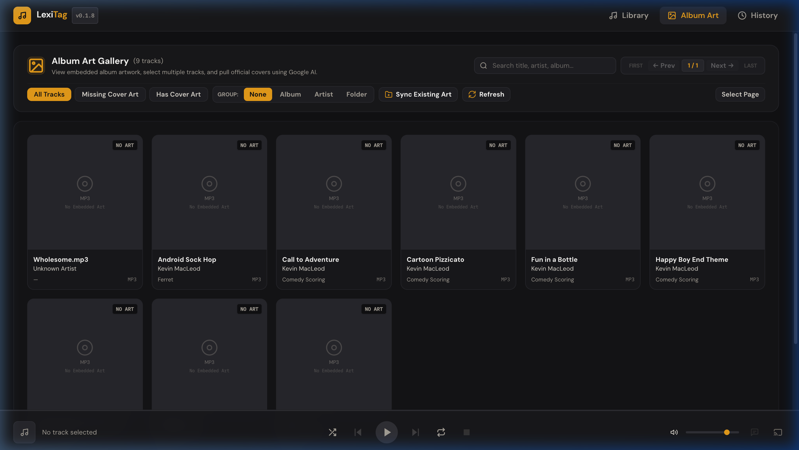
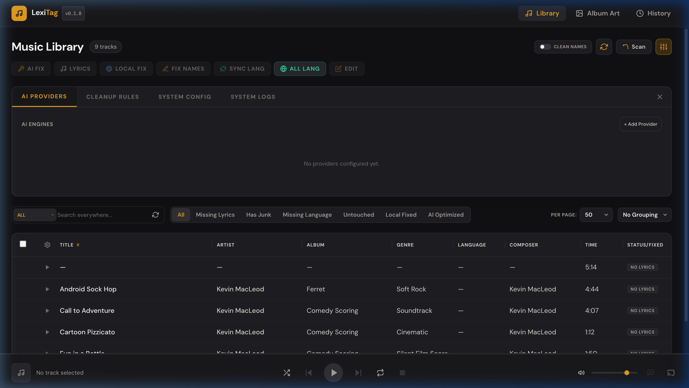
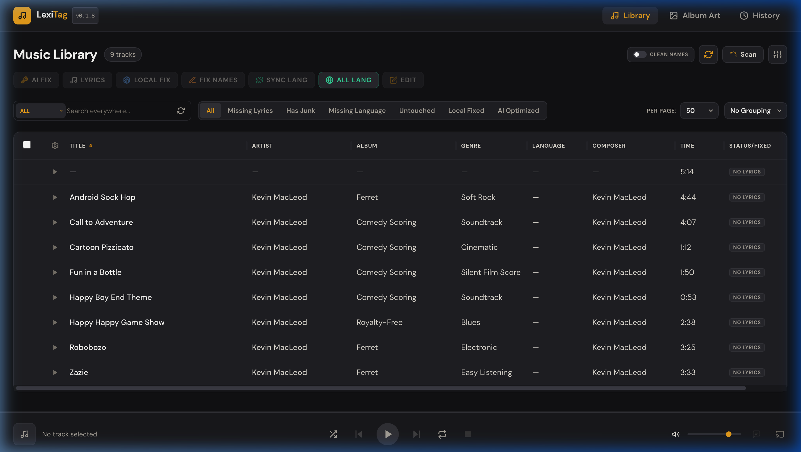

<div align="center">



# LexiTag

**Self-hosted AI-powered music metadata manager**

[](CHANGELOG.md)
[](https://hub.docker.com/r/lokeshsg/lexitag)
[](LICENSE)
[](https://www.python.org/)
[](https://reactjs.org/)

LexiTag scans your audio files, strips junk metadata, enriches tags with AI, fetches lyrics, and gives you a sleek web UI to manage your entire music library — completely self-hosted, no cloud required.

[Quick Start](#quick-start) · [Docker Deploy](#docker-deployment) · [Features](#features) · [Configuration](#configuration) · [Changelog](CHANGELOG.md)

</div>

---

## Screenshots

<table>
<tr>
<td width="50%">

**Music Library**


</td>
<td width="50%">

**Album Art Gallery**


</td>
</tr>
<tr>
<td width="50%">

**Settings & AI Providers**


</td>
<td width="50%">

**Smart Filters**


</td>
</tr>
</table>

---

## Features

### 🤖 AI Metadata Enrichment
Sends track information to a configured LLM (Gemini, OpenAI-compatible, Anthropic) to identify the correct title, artist, album, year, genre, composer, and language. Works across multiple languages and regional music libraries. Gracefully falls back when a track cannot be identified.

### 🧹 Metadata Cleaning
Removes junk embedded in tags: download-site URLs, promo watermarks, streaming labels, and comment spam. Uses a two-phase process — local pattern matching first, then a post-AI re-scan to catch anything that crept back in from search results. Custom junk patterns can be added in Settings.

### 🖼️ Album Art Gallery
Full-page gallery with group-by-album, group-by-artist, and flat-track views. Multi-select and bulk Apply / Remove operations. AI-powered artwork research using Gemini Google Search Grounding across Apple Music, Spotify, Deezer, Discogs, Wikipedia, MusicBrainz, and Cover Art Archive. Writes folder-level `cover.jpg` / `folder.jpg` for Navidrome and Jellyfin compatibility.

### 🎵 Lyrics
Searches LRCLIB for time-synced and plain lyrics. Falls back to Gemini Google Search Grounding for regional tracks not in LRCLIB. Saves lyrics directly into audio file tags (ID3 USLT, Vorbis LYRICS, MP4 ©lyr). Language is deduced from lyrics and stored as an ISO 639-1/639-2 code.

### 📻 Built-in Audio Player
Browser-based player supporting MP3, FLAC, WAV, ALAC, and M4A. Full seek via HTTP Range Requests. Per-track playback directly from the library table.

### 📡 UPnP / DLNA Casting
Discovers DLNA renderers (TVs, speakers, media receivers) on your local network and casts any track directly to the selected renderer from the UI.

### 📚 Library Management
- Multiple source directories with independent enable/disable toggles
- Configurable table columns: toggle, resize, and re-order (Title, Artist, Album, Genre, Language, Year, Composer, Time, Kbps, Type, Comment, Filename, Path, Status)
- Smart filters: All · Missing Lyrics · Has Junk · Missing Language · Untouched · Local Fixed · AI Optimized
- Column sorting on all major fields

### ⚡ Batch Processing
Select any tracks and run an AI fix, lyrics-only, local-only, or filename fix. Real-time progress panel with per-track step indicators. Stop & Clear to recover from a hung job. Accurate abort reporting.

### 🕒 History & Revert
Every change creates a per-field audit record. The History view shows before/after diffs with timestamps. Revert a single field, an entire track, or a whole batch with one click.

### ✏️ Manual Editing
Click any track to open the metadata editor. Edit any field manually. Bulk edit: select multiple tracks to update a shared field across all at once.

### 🔄 Periodic Auto-Scan Scheduler
Background library scanner with configurable presets (1 h, 6 h, 12 h, 24 h, 7 d) and custom intervals. Live countdown and last-scan timestamp shown in System Config. Non-blocking — prevents duplicate scans if a manual scan is already running.

---

## Requirements

- **Docker** (recommended) — or Python 3.12+ and Node 20+ for local dev
- An **LLM API key** (Google Gemini recommended — has a free tier)
- Optionally: a Google Custom Search API key for web search fallback

---

## Quick Start

```bash
# 1. Create a working directory
mkdir lexitag && cd lexitag

# 2. Copy the example environment file
curl -O https://raw.githubusercontent.com/lokesh-sg/lexitag/main/.env.example
cp .env.example .env
# Edit .env — add your LLM_API_KEY at minimum

# 3. Create directories for your music and database
mkdir -p music data
# Copy your audio files into ./music

# 4. Launch
docker compose up -d   # Pulls lokeshsg/lexitag:latest automatically

# 5. Open the UI
open http://localhost:3030
```

On first load, go to **Settings → Library Sources** and confirm `/app/music` is listed, then click **Scan** to index your files.

---

## Docker Deployment

The recommended way to deploy LexiTag is via Docker Compose using the pre-built image from Docker Hub.

**`docker-compose.yml`**

```yaml
services:
  lexitag:
    image: lokeshsg/lexitag:latest
    container_name: lexitag
    network_mode: "host"       # Required for UPnP/DLNA discovery
    environment:
      - MUSIC_DIR=/app/music
      - DATA_DIR=/app/data
    volumes:
      - ./music:/app/music     # Your host music folder
      - ./data:/app/data       # Persists the database
    restart: unless-stopped
```

> **Note:** `network_mode: host` is required for UPnP SSDP multicast to reach your local network. If you don't use DLNA casting, you can replace it with a standard port mapping (`- "3030:3030"`).

```bash
docker compose up -d
# Access at http://YOUR_SERVER_IP:3030
```

---

## Running Locally (Development)

**Backend:**
```bash
cd backend
python3 -m venv .venv && source .venv/bin/activate
pip install -r requirements.txt
uvicorn app.main:app --reload --port 3020
```

**Frontend:**
```bash
cd frontend
npm install
npm run dev
# Runs on http://localhost:3010, proxied to backend on 3020
```

Or use the convenience script from the project root:
```bash
./restart.sh
```

---

## Configuration

All settings are managed through a `.env` file in the project root. Copy `.env.example` to get started.

| Variable | Description | Default |
|---|---|---|
| `LLM_API_KEY` | API key for the LLM provider | **required** |
| `LLM_API_BASE_URL` | Base URL for the completions endpoint | Gemini endpoint |
| `LLM_MODEL` | Model identifier | `gemini-2.0-flash` |
| `MUSIC_DIR` | Path to the music library (inside container) | `/app/music` |
| `DATA_DIR` | Path for the SQLite database (inside container) | `/app/data` |
| `LEXITAG_AUTH_TOKEN` | Optional bearer token to protect the UI | none |
| `ALLOWED_ORIGINS` | CORS origins (comma-separated) | `*` |
| `GOOGLE_CSE_KEY` | Google Custom Search API key (optional) | none |
| `GOOGLE_CSE_CX` | Google Custom Search Engine ID (optional) | none |

Additional AI providers can be added and managed through **Settings → AI Providers** in the UI without editing `.env`.

---

## Ports

| Context | Service | Port |
|---|---|---|
| Development | Frontend (Vite) | 3010 |
| Development | Backend (uvicorn) | 3020 |
| Docker / Production | Combined | 3030 |

---

## Authentication

If `LEXITAG_AUTH_TOKEN` is set, all API requests require an `Authorization: Bearer <token>` header. The frontend reads this token from the `VITE_LEXITAG_AUTH_TOKEN` environment variable at build time, or from `window.LEXITAG_TOKEN` at runtime.

Leave both variables unset for local, unauthenticated access.

---

## Security

- **Non-Root Container:** The Docker image runs strictly as a dedicated non-root `lexitag` user.
- **Path Jailing:** The backend enforces strict path validation — files can only be read from or written to `MUSIC_DIR` and `DATA_DIR`.
- **SSRF Protection:** Strict URL scheme validation (`http://`/`https://` only) before fetching any AI-supplied image URL.
- **Encrypted API Keys:** Provider API keys are stored encrypted in the local database, not in plain text.

---

## How Tag Cleaning Works

LexiTag uses three cleaning passes on every track:

1. **Local Pass** — Pattern matching against a built-in and user-configurable list of junk strings (e.g., `Gaana.com`, `HiResTracks.com`, encoded URLs, comment spam). Runs before any AI call.

2. **AI Pass** — The cleaned tags are sent to the LLM with the filename and folder name as context. The AI identifies correct metadata and returns a structured result.

3. **Post-AI Pass** — The AI result is re-cleaned through the same local rules, preventing the AI from re-introducing junk it encountered in its search results.

Tags like `TSRC`, `TSSE`, and vendor-specific frames are explicitly stripped at write time.

---

## Multi-Provider AI Support

| Provider | Notes |
|---|---|
| **Google Gemini** | Default, recommended. Has a free tier. Supports Google Search Grounding for lyrics and artwork. |
| **OpenAI** | Any OpenAI-compatible endpoint supported. |
| **Anthropic Claude** | Supported via the settings panel. |

Providers can be added, switched, or disabled from **Settings → AI Providers**. Only one is active at a time. LexiTag retries on 429/503 errors with exponential backoff (8 s, 16 s) before marking a track as failed.

---

## Changelog

See [CHANGELOG.md](CHANGELOG.md) for the full version history with categorized changes.

**Latest: [v0.1.8](CHANGELOG.md#0180--2026-09-11)** — Album Art Gallery, AI Artwork Research Agent, 1-click Morphing Sync, Media Server Sync (Navidrome/Jellyfin), SSRF protection, and more.
